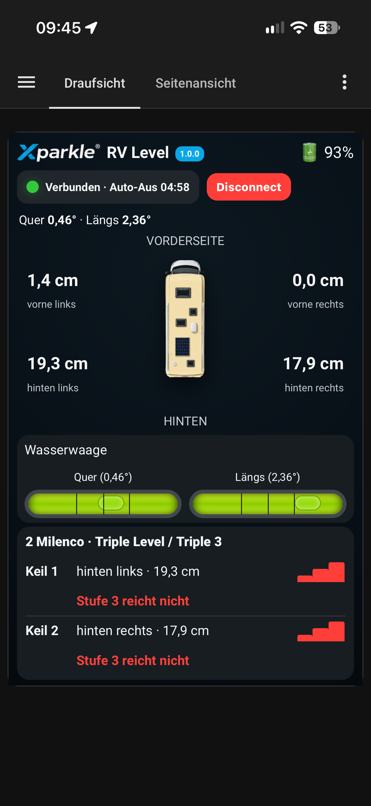
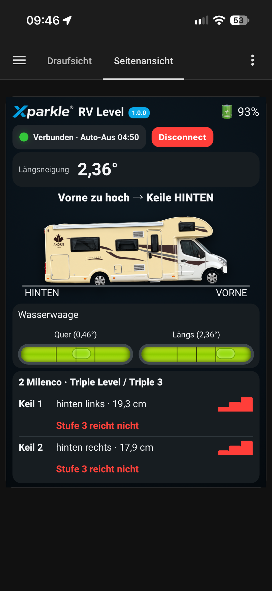
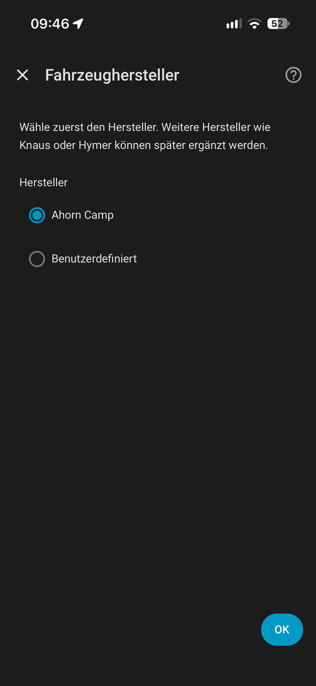
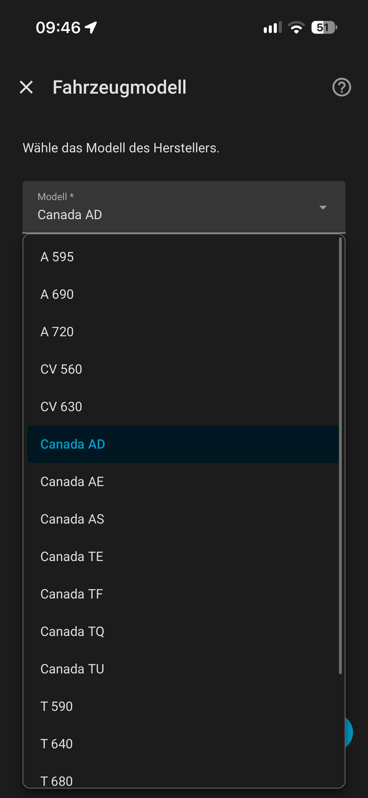
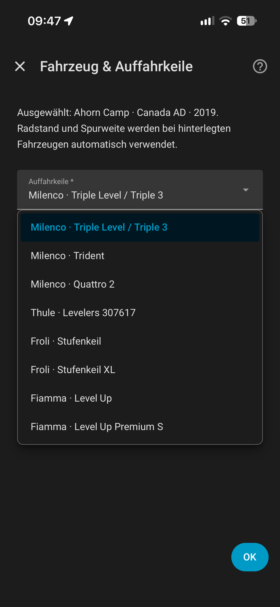

# RV Level Sensor for Home Assistant

Home-Assistant-Integration mit Dashboard-Karten für kompatible **RVLevel-Bluetooth-Nivelliersensoren**. Das Projekt ist nicht auf eine einzelne Handelsmarke beschränkt und ist für den von uns verwendeten **Xparkle RV Level Sensor** sowie den **RV Level Sensor von Fritz Berger** vorgesehen, sofern das Gerät das unterstützte RVLevel-BLE-Protokoll (`RVLevel-*`, Service UUID `FFF0`) verwendet.

> Aktuelle stabile Version: **v1.0.0** · Aktuelle Testversion: **v1.0.1-beta.5**.

## Funktionen

- lokale Bluetooth-Verbindung in Home Assistant
- Quer- und Längsneigung
- berechnete Höhendifferenz an den Rädern
- Draufsicht und Seitenansicht
- Wasserwaagen-Anzeige
- Auffahrkeil-Empfehlungen
- Fahrzeugprofile und Modelljahre
- Ahorn-Camp-Profile 2019–2026
- Canada AD 2019 mit eigener Originalgrafik
- automatische Bereitstellung und Registrierung der Dashboard-Karte
- automatische Erkennung des passenden Entity-Prefix
- einstellbare Sensorausrichtung: **Normal** oder **180° gedreht**

## Screenshots

### Dashboard

<table>
  <tr>
    <td align="center"><strong>Draufsicht</strong></td>
    <td align="center"><strong>Seitenansicht</strong></td>
  </tr>
  <tr>
    <td></td>
    <td></td>
  </tr>
</table>

Die Dashboard-Karte zeigt Quer- und Längsneigung, die berechneten Anhebehöhen, eine Wasserwaagen-Darstellung sowie die passende Auffahrkeil-Empfehlung.

### Konfiguration

<table>
  <tr>
    <td align="center"><strong>Hersteller</strong></td>
    <td align="center"><strong>Fahrzeugmodell</strong></td>
    <td align="center"><strong>Auffahrkeile</strong></td>
  </tr>
  <tr>
    <td></td>
    <td></td>
    <td></td>
  </tr>
</table>

Die Konfiguration ist für eine spätere Erweiterung um weitere Fahrzeughersteller ausgelegt. Für hinterlegte Fahrzeugprofile werden Radstand und Spurweite automatisch verwendet. Ab **v1.0.1-beta.5** kann zusätzlich die **Sensorausrichtung** auf **Normal** oder **180° gedreht** gestellt werden. Bei 180° werden Vorder-/Hinterachse sowie Links/Rechts für Winkel, Radhöhen und Keilempfehlungen entsprechend korrigiert.

## Voraussetzungen

- Home Assistant mit Bluetooth-Unterstützung oder Bluetooth Proxy
- kompatibler RVLevel-Sensor in Bluetooth-Reichweite
- HACS für die empfohlene Installation

## Installation über HACS

1. Dieses Repository in GitHub veröffentlichen: `schmidtbenjamin91-web/rv-level-sensor`.
2. In Home Assistant **HACS → Integrationen** öffnen.
3. Über das Menü **Benutzerdefinierte Repositories** öffnen.
4. Repository eintragen: `https://github.com/schmidtbenjamin91-web/rv-level-sensor`
5. Kategorie **Integration** wählen.
6. **RV Level Sensor** installieren.
7. Home Assistant vollständig neu starten.
8. **Einstellungen → Geräte & Dienste → Integration hinzufügen → RV Level Sensor** öffnen.
9. Sensor einschalten und das gefundene `RVLevel-*`-Gerät auswählen.

### Dashboard-Ressource

Ab v1.0.1 wird die JavaScript-Karte bei Lovelace im Storage-Modus automatisch als Modul-Ressource registriert. Die Integration stellt die Dateien unter `/rv-level-sensor/` bereit. Ein manueller Ressourcen-Eintrag ist bei einer normalen HACS-Installation nicht erforderlich.

Wer von Alpha 9.7.8 oder älter kommt, sollte den alten manuellen Eintrag wie `/local/xparkle-rv-level-card.js?v=978` einmalig entfernen, damit die Karte nicht doppelt geladen wird.

## Dashboard-Karten

Ab **v1.0.1-beta.3** wird der passende Entity-Prefix automatisch erkannt. Bei einer normalen Installation ist deshalb kein `entity_prefix` mehr nötig.

Hauptansicht:

```yaml
type: custom:xparkle-rv-level-card
```

Draufsicht:

```yaml
type: custom:xparkle-rv-level-top-card
```

Seitenansicht:

```yaml
type: custom:xparkle-rv-level-side-card
```

Falls die automatische Erkennung in einer speziellen Installation nicht möglich ist, kann der Prefix weiterhin manuell angegeben werden, zum Beispiel:

```yaml
type: custom:xparkle-rv-level-card
entity_prefix: sensor.rvlevel_410f
```

Die bestehenden Entity-IDs und der interne Integrations-Domainname `xparkle_rvlevel` bleiben in der v1-Serie bewusst erhalten, damit bestehende Alpha-Installationen ohne Migration weiterlaufen.

## Unterstützte Sensoren

Die automatische Erkennung erwartet derzeit Bluetooth-Geräte mit einem Namen `RVLevel-*` und der Service-UUID `0000fff0-0000-1000-8000-00805f9b34fb`. Handelsname und Gehäuse können abweichen. Falls ein Fritz-Berger-Gerät mit abweichendem Bluetooth-Namen oder einer anderen UUID ausgeliefert wird, bitte ein GitHub-Issue mit den Bluetooth-Informationen erstellen; dann kann das Profil ergänzt werden.

## Fahrzeugprofile

Die Fahrzeugauswahl ist hierarchisch aufgebaut: **Hersteller → Modell → Modelljahr → Auffahrkeil**. Dadurch können später weitere Hersteller wie Knaus, Hymer oder Dethleffs ergänzt werden.

Für die Darstellung gilt in der v1-Serie: **Canada AD 2019** behält die eigene Referenzgrafik. Alle anderen derzeit hinterlegten Fahrzeuge verwenden den gemeinsamen Fahrzeuggrafiksatz. In der Draufsicht ist vorne oben und hinten unten.

## Updates

Neue Versionen werden als GitHub Releases veröffentlicht, z. B. `v1.0.1`, `v1.1.0`. HACS erkennt neue Releases und kann die Integration aktualisieren. Durch die Versionskennung der automatisch geladenen Karte wird bei einem Release ein neuer Frontend-Pfad geladen, ohne dass der Benutzer die Dashboard-Ressource manuell ändern muss.

## Fehler melden

Issues: `https://github.com/schmidtbenjamin91-web/rv-level-sensor/issues`

Bitte Home-Assistant-Version, Sensor-Modell/Handelsname, Bluetooth-Gerätename und relevante Log-Ausgaben angeben. Keine privaten Zugangsdaten posten.

## Hinweis

Dies ist ein Community-Projekt und keine offizielle Integration von Xparkle, Fritz Berger, Ahorn Camp oder Home Assistant. Marken- und Produktnamen dienen nur der Kompatibilitätsbeschreibung.
